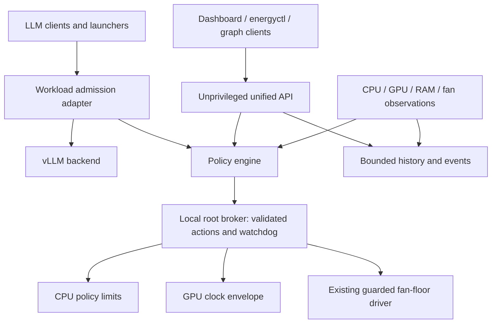

# Proposed unified controller

> The [current safety contract](10-current-safety-contract.md) is authoritative:
> GPU hardware commands must remain <=1800 MHz and 93°C is a test-abort boundary.

Status: design for discussion, not deployed or hardware-qualified.

Integration progress: `energy_control/unified_actuation.py` now provides one
serialized apply path using the existing guarded CPU step, logged GPU setter
contract and modular fan-floor adapter. It validates immutable hardware limits
and the recorded trial envelope, records a candidate before acting, raises
cooling first, applies CPU reductions before GPU changes, permits CPU increases
only afterward, and lowers cooling last. Ownership and fresh safety frames are
rechecked between stages; final CPU/fan readback and GPU setter evidence are
checked separately. GPU setter evidence is not numeric accepted-cap readback.
Any failure latches the whole cycle and attempts owned-workload abort before
writing its abort event. There is no automatic retry or rollback that raises
clocks after a partially applied transaction.

Four unified-path tests plus ten CPU-actuation tests pass with fake hardware,
covering mixed-class ordering, GPU/fan failures, envelope rejection and ownership
loss after candidate sync. This is an integration component, not the installed
service: process supervision, fresh-source wiring, configuration commits and
single-owner migration remain unfinished. It must not be used without an
independent guard that can abort while an adapter or disk operation blocks.
Safety-source calls must provide genuinely new acquisition frames, not retimestamp
cached data to satisfy the monotonic checks. RAM protection is not managed here.

`UnifiedController.tick` now connects the existing policy directly to this
shared apply path. It requires matching policy/actuator configuration and
serializes complete ticks. Startup holds, post-readiness ramps and lifecycle
signal loss flow through to all three adapters. Policy aborts stop owned work
without treating emergency proposal values as permission to perform more
hardware writes; a failed cycle cannot resume on a later tick. The unified
test block has five passing tests, including policy-to-actuator startup/recovery
and latched signal-loss behavior. These use fake adapters, not live hardware.
This does not yet supply a service entrypoint, real manager readiness adapter,
authenticated runtime configuration handover or an independently supervised
live control loop. Successful application alone is not workload admission.

`llm_readiness.py` adds a read-only container-bound health probe and a single
startup-generation state machine. HTTP non-readiness keeps startup ceilings
held without restarting; readiness must remain observed for two seconds.
Container change, stale/missing observations, lost health after readiness or
the bounded startup deadline latch a fault. A separately verified mapping from
the local health endpoint to the pinned container is mandatory: matching a
container name around HTTP 200 alone is not proof of endpoint ownership.
This reader has no start/stop or RAM-service operation, and must run outside
the independent thermal guard because Docker/HTTP I/O can block. Eight combined
readiness/unified-cycle tests passed using fake dependencies, including a
two-minute loading sequence. Live endpoint-route qualification and service
wiring remain outstanding.

## One product and API, explicit privilege boundary

Clients connect to one versioned API. Internally use two security domains:
unprivileged API/policy/history and a root broker over a permission-restricted
Unix socket. Per the operator's clarified scope, package them under one
`energy_control.service` lifecycle with supervised internal processes, explicit
readiness and one owner for each CPU/GPU/fan actuator—not independently operated
CPU, GPU and fan controller services. The network child drops privileges before
binding sockets; only the narrow broker keeps hardware privileges. An independent
guard must survive a policy/API child failure and finish protective actions
before the supervisor exits. This is the deployment target, not an installed unit.
A single network-facing root process
would unnecessarily combine input parsing, passwords, graph queries and hardware
privilege. The existing dashboard stays the landing page and consumes this API.

### External RAM protection and workload separation

RAM protection is a separate operator-owned project. Do not migrate its logic,
change its settings, or start/stop/restart its service as part of energy-control
handoff, shutdown or rollback. Available memory may be observed for commissioning
admission/abort checks; it is not another actuator owned by this service.

The operator reports no RAM issue when LLM and GPU matrix burn-in are not run
together. Preserve that mutual exclusion, including model loading and retained
model allocations—not just active request counts. GPU matrix burn-in is entirely
excluded until a dedicated later go. This operational report does not certify
unlimited memory for every model, context length or concurrency setting.

Read-only inspection of the existing dashboard manager found that its LLM
`stop` action also stops the RAM guard, and `start` starts the guard if absent.
These are external manager behaviors, not energy-control responsibilities.
Do not use that stop route as a RAM-neutral emergency action. The scoped pinned
container-stop adapter does not manage the RAM guard. Normal LLM launch remains
through the manager API as requested; require the external RAM guard already
active before any future launch and explicitly account for the manager's
coupling. No external manager code was changed by this review.

Use a dedicated environment, not HostApp' virtual environment. Candidate
implementation: typed Python policy/API with FastAPI, NVML adapter, compact
in-memory multiresolution history and a small separately testable broker. Choose the broker language after
prototyping timeout/isolation behavior; correctness of the boundary matters more
than sharing language with the UI. No graph database or disk graph history is needed.
Keep control independent of graph queries. See [the screenshot and retention
contract](07-telemetry-memory.md). Configuration and privileged audit persistence
are separate from graph telemetry. Commissioning also requires the bounded durable
[crash recorder](08-prefill-ramp-crash-recording.md).

## Control contract

Discover CPU policy identities, GPU identity and the fan device by stable types.
Keep requested, accepted, observed and hardware-maximum values distinct.
API frequency units are MHz; CPU sysfs conversion to kHz occurs once in its adapter.
NVML is preferred over parsing CLI output; CLI fallback uses fixed argv/timeouts.
Unsupported controls remain unavailable, never treated as successful no-ops.

The GPU hard maximum is **1800 MHz**, including bootstrap, idle and first load.
The offline model's provisional first-load ceiling is 1200 MHz, which may rise
gradually under sustained safe load but never past 1800 MHz. These are not yet
hardware-qualified settings. The proposed actuator is a maximum cap, not a
command to hold a fixed GPU clock at idle.
Supported steps and effective enforcement require qualification
on this GB10: a nearest-frequency API must not silently round above the envelope.
`clocks.max.graphics=3003` is the hardware rating, not applied-limit readback.
Track whether limit verification is direct, inferred or unavailable. Never claim
a verified cap from a single low-frequency sample. If the ceiling cannot be
established, keep load admission closed and expose the failure.

No wattage limit is part of the initial guaranteed feature set: it reports N/A
on the inspected machine. Discover such capability read-only; qualify any setter
separately. GPU power telemetry is not total system power. Board-level power
budgeting needs trustworthy board/input measurements before tuning.

Precedence, highest first: firmware protections; broker safety envelope and
fault response; temperature/memory constraints; startup/ramp envelope; user
profile; performance optimization. A manual override is time-limited and cannot
override safety. Each applied decision carries its limiting reason and revision.

## Coordinated CPU and fan policy

Start from the existing fast-first CPU controller and recorded behavior, not
untested gains. Use monotonic time, explicit physical units, filtered derivative,
anti-windup and elapsed-time-based slew limits. The legacy 93°C PID target is
not a commissioning target: owned test loads abort by 93°C or earlier on a
predicted breach. CPU/GPU operating targets must be lower. Sensor thresholds remain
separate. Until sensor mapping is validated, report and conservatively use the
hottest ACPI zone without pretending it is a precisely identified CPU sensor.

Fans use the existing additive floor states 0–12. Validate strictly increasing
temperature breakpoints and nondecreasing states. Combine thermal demand,
temperature slope, workload anticipation and post-load cooling with a maximum
selector. Thermal emergency bypasses normal fan slew limits. Normal decreases
use hysteresis and a dwell period; firmware retains authority for more cooling.
Expose actual RPM for both fans and requested floor separately. Verify fan spinup
against calibrated RPM/time windows; sustained fan mismatch blocks load increase.

The initial migration keeps maximum fans while CPU/GPU ownership is qualified.
Adaptive fan curves are introduced later. At present load, the roughly 90°C
hottest zone would already saturate the legacy 70°C-to-state-12 curve.

## LLM-first operating states

“Full load by default” means maximize useful work when queued, within the safe
envelope. It does not mean running dummy GPU work to keep the machine hot.

| State | Entry / exit | Cooling, clocks and admission |
| --- | --- | --- |
| BOOTSTRAP | Boot, driver reset, resume, ownership change | Admit no new work; discover devices, establish safe limits and sensor freshness |
| IDLE | Valid zero GPU utilization or explicit workload completion | Immediately rearm to a qualified entry ceiling <=1800 MHz; fan demand follows residual heat; model stays resident |
| PREPARE | Request or model-load reservation arrives | Hold work; request fan floor, verify RPM and headroom, apply and acknowledge starting clock envelope |
| RAMP | PREPARE gates satisfied | Release bounded initial work; raise GPU ceiling incrementally while observing response |
| RUN | Ramp complete with stable observations | Permit workload capacity up to qualified maximum, subject to thermal/memory limits |
| WARM_READY | Queue drains | Keep cooling/headroom briefly, but reset to the qualified entry ceiling immediately |
| COOLDOWN | Cooling grace expires | Keep the qualified entry ceiling; decay fans only after temperatures and slopes settle |
| DERATED | Low headroom or excessive rise | Reduce clocks immediately, hold further admission; recover slowly after stable dwell |
| FAULT | Stale critical sensors, failed actuator, lost owner | Safe caps and maximum requested cooling where controllable; admission closed; explicit recovery |

WARM_READY is a fan/cooling grace, never a grace for elevated clock limits.
Re-enter RAMP from the baseline after every idle event. A zero sample can be a
short intra-request gap: lower the ceiling anyway, but do not mark the request
finished or unload its model. Missing utilization is not zero and forbids ramp-up.
New prefill during an already busy run also requires pre-admission rearming;
utilization alone cannot reveal that transition. See the detailed ramp contract.

The admission adapter must act **before** a request reaches vLLM. Scraping
`num_requests_running` and utilization is useful feedback, but arrives after
work has started. Route direct clients and the Docker bridge through the same
gate, or provide mandatory cooperative reservation hooks with audited coverage.
Public energy endpoints and inference routes can share the product gateway;
the root broker never parses inference requests.

Use bounded queues, reservation expirations, client cancellation, streaming
backpressure and request deadlines. A rejected gate returns a clear retryable
status. Require workload-scoped identity; a viewer cannot reserve unlimited GPU
capacity. An expired lease is not proof a GPU job stopped: reconcile active
inference/utilization before classifying idle. Controller failure closes new
admission while the broker protects any existing work.

A single long-prompt prefill can saturate the GPU. Concurrency=1 alone is not a
power ramp. Combine the low initial clock cap with validated engine batching /
prefill limits. Engine options that require restart are deployment settings,
not imaginary runtime API knobs. Cover model loading, warmup and graph capture
in the startup admission protocol too. Do not unload/reload models on each idle
transition; that introduces additional memory and startup transients.

## Initial tuning experiment, not a shipping profile

Candidate timings: control ticks 250–500 ms; EC polling 1–2 s, serialized and
cached; raise GPU ceiling by at most 100 MHz/s; optional 30 s fan cooling grace;
temperature projection over the next 2–5 s. These numbers are hypotheses to test.
The model's idle/first-load ceiling is provisionally 1200 MHz; validate an
at-or-below-1800 MHz entry ceiling and transient behavior before deployment.
Busy dwell and any increase within the hard limit remain to be qualified.
Keep deployed behavior unchanged during planning.

Calculate `effective_gpu_max = min(qualified_hard_max, profile_max, ramp_max, thermal_max,
fault_max)` and cap CPU classes through the same arbiter. Increase at most one
major performance actuator per observation window to avoid simultaneous CPU/GPU
surges. Favor inference by deferring background CPU work; do not starve its CPU
tokenization/scheduling path. Rapid reductions bypass recovery slew limits.

Ramp only with fresh sensors, verified actuators, sufficient memory and acceptable
temperature slope/projected headroom. Freeze or retreat on rising temperature,
throttling or electrical warnings. Millisecond/submillisecond electrical spikes
can occur below sensor and software-loop resolution. Clock ramps reduce risk;
they do not guarantee supply stability. Validate the power adapter and collect
appropriately sampled input-power evidence if the fault persists.

## Failure containment and ownership

One broker owns CPU/GPU/fan policy; each actuator has a serialized adapter. A
lease/heartbeat between policy and broker expires into a safe profile. The broker
independently validates ceilings and critical thermal freshness. It cannot rely
on a policy-provided temperature or a forged “healthy” field.

EC calls run in an isolated bounded worker so a firmware stall cannot block CPU
protection. Do not launch replacement EC writers behind a stuck call; mark the
fan path unavailable, retain firmware protection and restrict workload. A stuck
kernel call is not necessarily interruptible by a userspace timeout.

API/history failure must not disable safety. A broker watchdog/restart path must
establish safe caps before readiness. No userspace process protects a completely
frozen kernel; firmware protection and hardware fault diagnosis remain essential.
On stop, do not blindly reset GPU clocks to their unrestricted default. Preserve
the established ceiling and hand fans to firmware only through a verified handoff.
Suspend/resume and GPU resets invalidate readiness and trigger BOOTSTRAP.

For partial multi-actuator failure, hardware transactions are not atomic: record
completed writes, retain stricter limits, request cooling, close admission and
report FAULT. A rollback that raises clocks while hot is prohibited. Detect drift
or another writer; do not endlessly fight it. Existing RAM emergency protection
remains independent until equivalent coverage has been demonstrated.
