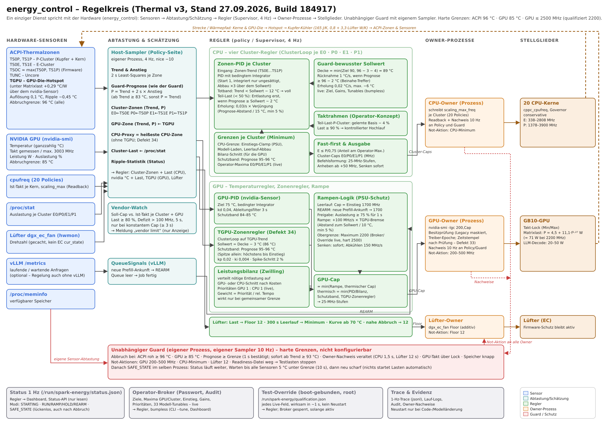

# Control architecture (thermal v3, builds 20260927T184917 and later)

The schematic (`54-regelkreis.svg`, German) shows the whole loop: sensors,
sampling and estimation, the controllers and their links, the owner
processes, the actuators, the thermal plant feedback, the independent guard
and the operator paths. This page is the reference text for it. Details and
evidence are in doc/48–53.

## Principles

- **One hardware talker.** Only `energy_control` reads and writes the GPU,
  CPU and fan hardware. Spark_Dashboard, the status API and every other
  consumer read `/run/spark-energy/status.json` (1 Hz). This rule is from
  the operator (27 September 2026) and is recorded in AGENTS.md.
- **Never blind.** The service publishes throughout its life:
  - `STARTING` while it waits for the sensors to cool;
  - `RUN` / `RAMP` / `HOLD` / `REARM` / `COOLDOWN` in control;
  - `SAFE_STATE` after an abort. The process stays up, keeps sampling, and
    re-arms in-process after cooling.

  Only a code or model install restarts the process (gap about 1 s).
- **Live settings.** Every setting except the CPU class maxima changes
  without a restart:
  - the operator broker (password, audit);
  - the boot-bound test override `/run/spark-energy/qualification.json`.
- **Safety below the targets.**
  - The aborts are fixed: ACPI 96 °C (raised from 93 °C by the operator on
    27 September 2026), GPU 85 °C, and their projection rules.
  - Every target sits below its abort with a guard-aware margin.
  - The guard is an independent process with its own sampler.

## Signals

| Sensor | Read by | Used for |
| --- | --- | --- |
| ACPI zones TS0P, TS1P, TS0E, TS1E | host sampler (4 Hz), guard sampler | cluster loops (per zone), CPU proxy, guard aborts |
| TUNC | same | CPU proxy, guard aborts |
| TSOC (firmware maximum of all zones; equals TGPU under GPU load) | same | guard aborts only; no CPU proxy (defect 37) |
| TGPU (GPU die hotspot) | same | GPU zone loop, guard abort |
| nvidia-smi: temperature, clock, power, utilisation, maximum | same | GPU PID (75 °C), ramp gate (≥ 75 % for 1 s), vendor watch, guard (clock above lock) |
| cpufreq measured clock and readback | host sampler, CPU owner | vendor watch, owner evidence |
| `/proc/stat` per cluster | service | busy/partial gating, learned envelope, vendor watch |
| fan RPM (cached hwmon, never EC `cur_state`) | service | fan health (guard) |
| vLLM `/metrics` running/waiting | service (optional) | recorded; REARM on a new prefill only with `prefill_rearm` = 1 (off since 28 Sep); control works without vLLM |

Estimation (the same formulas as the guard):
- 2 s least-squares trend and rise per zone.
- Projection P = trend + 2 s × rise once the trend is ≥ abort − 10 °C
  (86 °C for ACPI; otherwise P = trend).
- The CPU proxy is the hottest CPU zone without TGPU (defect 34) and
  without TSOC, which mirrors TGPU (defect 37).

## Controllers (policy / Supervisor, 4 Hz)

**CPU, per cluster (E0, P0, E1, P1): `ClusterLoop`**
- PID on the cluster zone trend, with a conditional integrator: it starts
  at 1 and integrates only while unsaturated; wind-down ×3 above the
  setpoint.
- Guard-aware setpoint:
  - ceiling = min(target, 96 − 3 − trend margin), with target 90 and
    margin 4 = 89 °C (operator target up to 92, margin tunable down to 1);
  - back-off 1 °C/s while the projection is ≥ 94 °C;
  - recovery 0.02 °C/s, at most 6 °C below the ceiling.
- Recovery rate 0.03/s, tapered by the projection's distance to the
  setpoint (15 °C band, minimum 5 %).
- Controlled envelope: a partly loaded P cluster waits at its learned
  full-load cap − 4 % and ramps once busy ≥ 90 %.
- Bounds, the minimum of:
  - the shared CPU limit (PSU entry clamp, model loading, idle-down);
  - the power-balance cut;
  - the last-resort band (projection 95–96 °C);
  - the operator's cluster maxima.
- Fast-first: E ≤ P / 0.75 of P's operator maximum.
- Output: cluster caps with command shaping (25 MHz steps, raises only past
  50 MHz, cuts at once) to the CPU owner.

**GPU**
- **GPU PID** on the nvidia sensor: target 75 °C, conditional integrator,
  kd 0.04, derivative filter 3 s, last-resort band 84–85 °C.
- **TGPU zone loop** (defect 34): a cluster loop on the TGPU trend with
  its own gains (kp 0.02, ki 0.004, kd 0), setpoint = CPU ceiling − 3 °C
  (86 °C at ceiling 89), last-resort band (projection 95–96 °C). A
  projection spike alone cuts the cap by at most 2 % of its span per tick;
  a trend inside the band cuts fully. The gains and margin were tuned in
  the twin against the 2200 MHz oscillation (doc/55).
- **Power balance** (twin LP) splits a needed relief between GPU and CPU
  cuts by cost. The priorities are GPU 1 : CPU 1 (`priority_gpu`,
  `priority_cpu`), weighted by each load's
  relative speed; the balance matters only when a shared limit binds.
- **Ramp** (PSU protection; load detected by GPU utilisation only since
  28 September 2026):
  - idle cap = entry 1700 MHz; idle is GPU utilisation < 20 % for 1 s
    (`idle_util_threshold`; GB10 reads 8–11 % with nothing running,
    defect 36);
  - no REARM on a new prefill (operator, 28 September 2026: "we detect load
    only on GPU utilisation, prefill we don't need to look at any more");
    `prefill_rearm` = 1 switches it back on, e.g. for owned trials;
  - release at utilisation ≥ 75 % for 1 s;
  - +100 MHz/s, slowed by the TGPU headroom (10 °C band, minimum 5 %);
  - maximum 2200 MHz (live; hard limit 2500);
  - cuts at once; idle cool-down 150 MHz/s.
- **GPU cap** = min(ramp, thermal cap), in 25 MHz steps, to the GPU owner.

**Fan**
- Floor 12 under load, the minimum after 300 s idle.
- The curve adds cooling from 70 °C.
- 12 near an abort.

## Owners (one writer per actuator)

| Owner | Writes | Evidence | Emergency |
| --- | --- | --- | --- |
| CPU | `scaling_max_freq` per cluster | readback, 10 Hz to policy and guard (valid 1.5 s) | CPU minimum |
| GPU | `nvidia-smi -lgc 200,cap` | ownership check (legacy units masked, driver epoch), setter evidence 10 Hz (valid 1.5 s since defect 33b) | lock 200–500 MHz |
| Fan | `dgx_ec_fan` floor (additive only) | readback (valid 12 s) | floor 12 |

## Independent guard

Its own process and its own 10 Hz sampler. It aborts on any of:
- ACPI raw ≥ 96 °C, or GPU ≥ 85 °C;
- a projection ≥ the limit, confirmed for 1 s, or at once when the trend is
  ≥ abort − 3 °C (93 °C ACPI);
- stale owner evidence;
- a GPU clock above the lock;
- low memory.

The emergency actions go to every owner, and the readiness file is removed,
so the test loads stop. The controller then holds `SAFE_STATE`, waits until
every sensor is 5 °C below its limit for 10 s, and re-arms. It never starts
a load itself.

## Operator paths

- **Operator broker** (password, audit): targets, GPU maximum and entry,
  per-cluster CPU maxima, gains, priorities and the 33 model tunables
  (`broker.TUNABLES`; CLI `--tune NAME=VALUE`, `--untune NAME`), applied
  bumplessly.
- **Test override** (root, current boot only): any live field, active within
  about 1 s. The broker refuses proposals while it is active. Removing the
  file restores the committed configuration.
- **Status** (1 Hz) carries:
  - the effective limits and override;
  - every tunable's effective value (`control.tuning`);
  - setpoints, integrals, learned caps, the vendor watch, and requested
    versus measured clocks.
